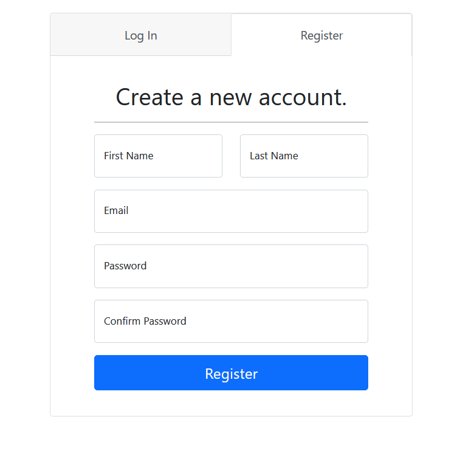
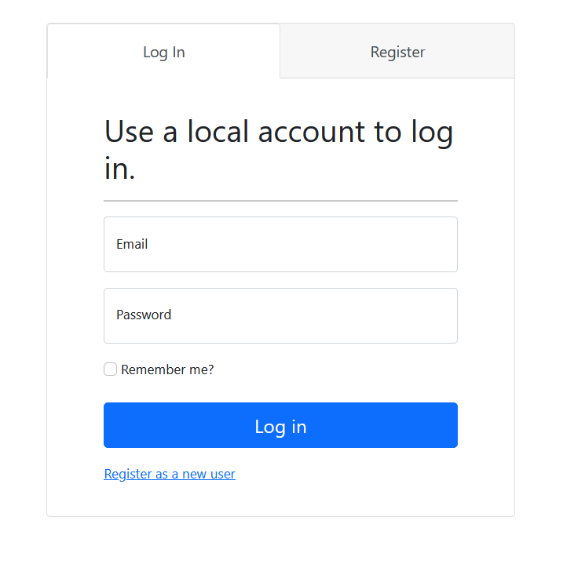

# Inventory Management System (IMS) for TodoSeUsa

Project Description
-------------------
Hello I'm **[Matias Rojas](https://www.linkedin.com/in/matiasrojasmargaritini/)** ([LinkedIn](https://www.linkedin.com/in/matiasrojasmargaritini/)). This project is a simple inventory management system made with **C# .NET 7** for our family clothing store **TodoSeUsa**.

  This **IMS** project will allow you to create, edit, and save clients, bills and products to a **SQL Server** database and keep them secure with the login system. If you find my project useful star :star: the repository :smile:. You can also [support me financially here]() or by leaving a comment in my **[LinkedIns post]()**. 

## Table of contents
* [Introduction](#project-description)
* [Features](#features)
* [Setup](#setup)
* [Features](#features)
* [The Site](#the-site)

## Showcase




*Login and register screens*


*Simple and friendly menu*

## Features

- Accounts system (register, login and logout) implemented with .NET Identity.
- CRUD operations over products, clients and bills.
- Listing, searching and filtering the entities above.

## Setup

Follow these steps to set up the project on your local machine.

### Prerequisites

- [.NET 7 SDK](https://dotnet.microsoft.com/download/dotnet/7.0)

### Installation

1. **Clone the repository:**

    ```sh
    git clone https://github.com/Abstr4/TodoSeUsaNet7
    cd TodoSeUsaNet7
    ```

2. **Set up environment variables:**

    You need to set up an environment variable for your connection string.

    - On **Windows**:

      - (change the database name to whatever you like)
      
      Open Command Prompt or PowerShell and run:

      ```sh
      setx ConnectionStrings__DefaultConnection "Server=localhost;Database=TodoSeUsaNet7;Trusted_Connection=True;MultipleActiveResultSets=true;TrustServerCertificate=true"
      ``` 

      Or add it to your system environment variables through the Control Panel.

    - On **Linux/macOS**:

      Open your terminal and add the following line to your `.bashrc`, `.zshrc`, or `.bash_profile` file:

      ```sh
      export ConnectionStrings__DefaultConnection="Server=localhost;Database=TodoSeUsaNet7;Trusted_Connection=True;MultipleActiveResultSets=true;TrustServerCertificate=true"
      ```

      Then, run:

      ```sh
      source ~/.bashrc  # or ~/.zshrc or ~/.bash_profile
      ```

3. **Restore dependencies:**

    ```sh
    dotnet restore
    ```

4. **Build the project:**

    ```sh
    dotnet build
    ```

5. **Run the project:**

    ```sh
    dotnet run
    ```
    
6. **Restore, build and run from your IDE**

  I use Visual Studio IDE, works perfectly.

## 


